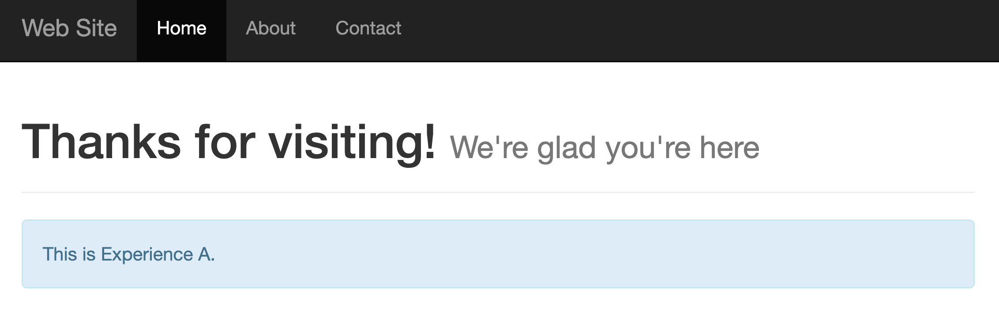
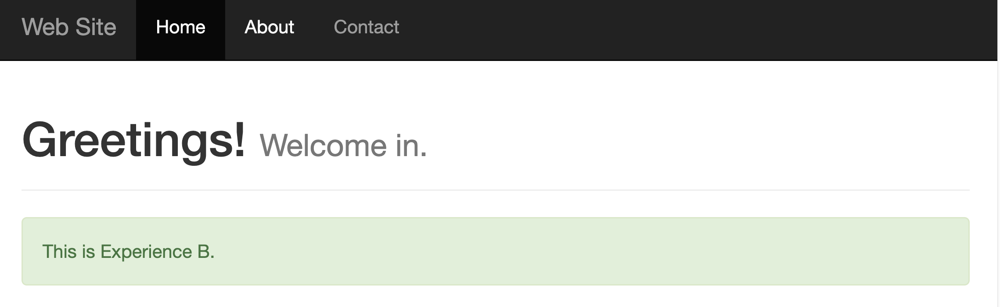
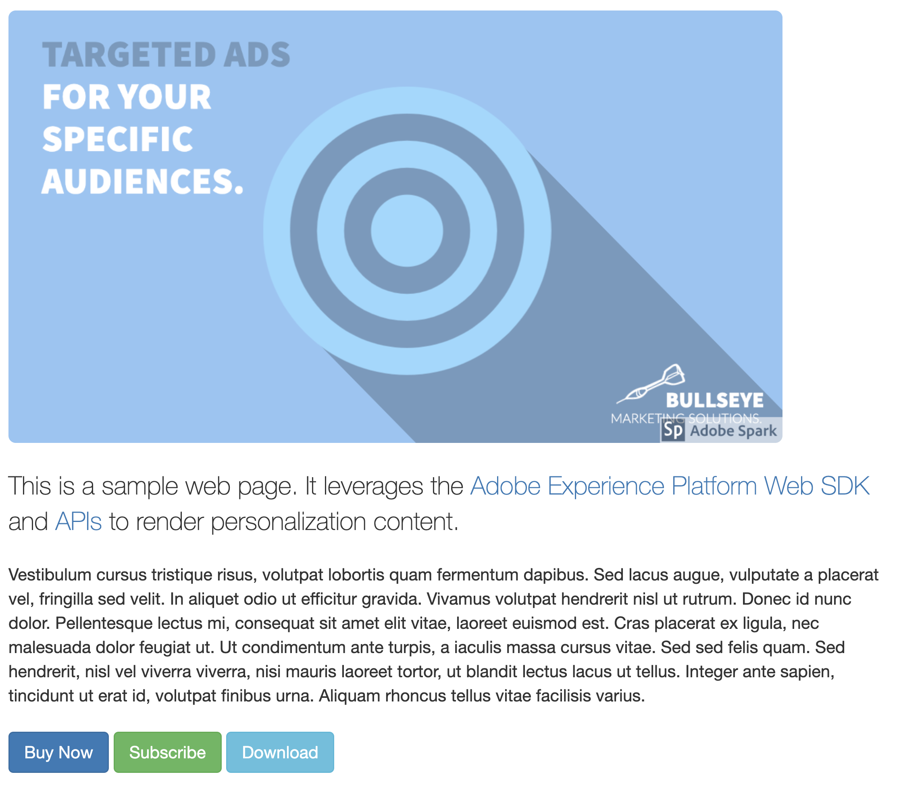
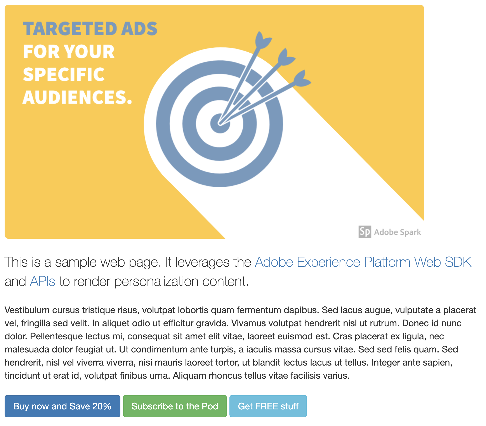
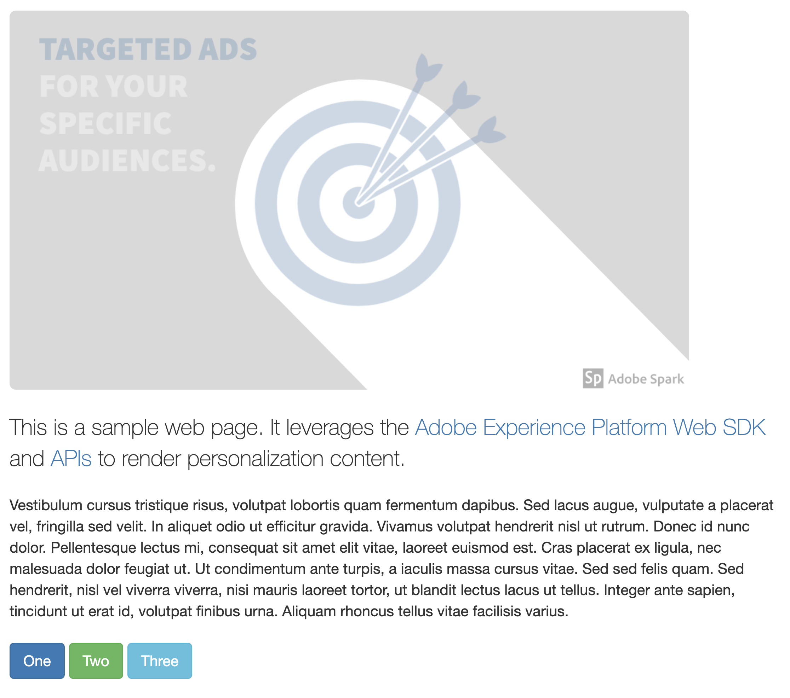

# Summary of Target Activities Used

There are two target activities that impact the page.

## Activity 1

[//]: # (https://experience.adobe.com/#/@unifiedjslab/target/activities/activitydetails/A-B/aep-edge-samplesvecoffer)

Activity 1 is an A/B test activity created using the Visual Experience Composer (VEC).  It has two experiences each one changing the header text and adding an alert beneath it.

| Experience                   | Visual treatment                                                    |
|------------------------------|---------------------------------------------------------------------|
| Experience A                 |  |
| Experience B                 |  |
| Default (no personalization) |  |

## Activity 2
[//]: # (https://experience.adobe.com/#/@unifiedjslab/target/activities/activitydetails/A-B/aep-edge-samplessample-hero-image)
Activity 2 is an A/B test activity created using the Form Based Composer.  It provides offers in the JSON format.  The implementation uses the JSON values to update the hero image and button text/actions on the page.

<table>
  <thead>
    <tr>
      <th>Experience</th>
      <th>JSON Offer / Visual treatment</th>
    </tr>
  </thead>
  <tbody>
    <tr>
      <td>Experience A</td>
      <td>

```json
{
  "heroImageName": "demo-marketing-offer1-exp-A.png",
  "buttonActions": [
    { "id": 1, "text": "Buy Now", "content": "Thanks for your purchase!" },
    { "id": 2, "text": "Subscribe", "content": "You are now subscribed!" },
    { "id": 3, "text": "Download", "content": "Downloading..." }
  ]
}
```

</td>
    </tr>    
    <tr>
      <td>Experience B</td>
      <td>

```json
{
  "heroImageName": "demo-marketing-offer1-exp-B.png",
  "buttonActions": [
    { "id": 1, "text": "Buy now and Save 20%", "content": "Thank you for your purchase!" },
    { "id": 2, "text": "Subscribe to the Pod", "content": "Thank you for subscribing!" },
    { "id": 3, "text": "Get FREE stuff", "content": "Use coupon code THANKYOU at checkout." }
  ]
}
```

</td>
    </tr>    
    <tr>
      <td>Default (no personalization)</td>
      <td>
        
      </td>
    </tr>
  </tbody>
</table>
