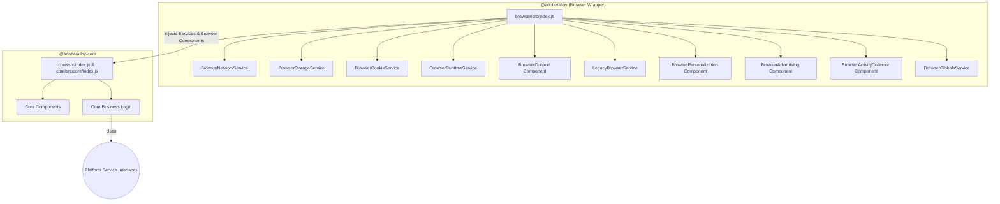

This is the rough plan to migrate into the "Universal JavaScript SDK"

- [x] create two packages - a `core` package for shared business logic and primatives, and a `browser` package for browser-specific functionality and APIs
- [ ] Initialize nodejs sdk, with the understanding that it will not function until all the migrations are done
- [ ] Migrate components whose purpose and functionality are entirely browser dependent. Ask "does this functionality work on a server?"
  - [x] `ActivityCollector`
  - [ ] `Context` -> rename to `BrowserContext`
  - [ ] `Personalization` -> `BrowserPersonalization`
  - [ ] `Advertising`
  - [ ] `PushNotifications`
    - Some of this probably could stay in core, like request/payload helpers stay in core, but browser apis would obviously need to be moved
- [ ] Create platform-agnostic "capabilities" that are injected from platform package into core package
  - [ ] `network` (fetch, sendBeacon)
  - [ ] `storage` (make async, localStorage)
  - [ ] `LegacyImplementationService` (for migrating from Visitor.js)
  - [ ] `RuntimeService` (setTimeout, etc. )
        All steps should proceed imperceptably - no breaking changes, no new bugs, no changes to user configurations.
  - [ ] `GlobalsServie` (varialbles currently on `window` like `window.__alloyNS`, monitors, queue)
- [ ] Migrate usage of these apis to these capabilities one at a time.

---

# Big, partially incomplete AI-generated plan.

## Overview

To make `@adobe/alloy-core` platform-agnostic, we will refactor it to accept coarse-grained, usage-based service objects via Dependency Injection. The `@adobe/alloy` (browser package) will provide the concrete browser implementations. DOM-heavy components and browser globals (`window.__alloyNS`, `window.Visitor`) will be managed entirely in the browser package or behind injected service layers. We will adopt an incremental migration strategy, delivered PR by PR, extending existing eslint-plugin-compat linting and leveraging TDD to verify the abstractions.

## Scope and non-goals

In scope:

- Remove direct browser-global usage (`window`, `document`, `navigator`, `indexedDB`, `setTimeout`, `setInterval`, `URL`, `atob`, `btoa`, `requestAnimationFrame`, `MutationObserver`, Service Worker APIs) from core runtime paths.
- Move browser bootstrap and global-state contracts (snippet queue, monitor globals) to `packages/browser`.
- Move browser-specific components (Context, Personalization, ActivityCollector, Advertising) to browser ownership.
- Make StorageService fully asynchronous to support non-browser backends (Redis, AsyncStorage).
- Support component-level exclusion for browser-specific features without changing default browser behavior.
- Keep browser behavior stable throughout migration.
- End with `@adobe/alloy-core` importable and executable in non-browser runtimes when supplied with services.

Out of scope:

- Command-level consent for server-side multi-tenancy (future phase, after portability achieved).
- Redesigning component business logic.
- Large one-shot refactors.

## Where we stand today

### 1) Core is not import-safe outside the browser

Running `node -e "import('./packages/core/src/index.js')"` fails with `ReferenceError: window is not defined`. Browser-dependent modules are pulled in at module scope:

- `packages/core/src/index.js:32-33` — `const { console } = window;` and `const createNamespacedStorage = injectStorage(window);`
- `packages/core/src/core/index.js:62` — `const { console, fetch, navigator } = window;`
- `packages/core/src/components/Context/index.js:24-30` — `const web = injectWeb(window);` and similar
- `packages/core/src/components/ActivityCollector/index.js` — `injectStorage(window)`

These module-scope references are the #1 blocker for Node importability and must be addressed in the earliest PRs.

### 2) Browser globals are widely referenced in core

Beyond `window` and `document`, core reaches for many browser-specific APIs directly:

- **Timers**: `setTimeout`, `clearTimeout` in BrandConcierge, StreamingMedia, Advertising, and DOM utilities.
- **Network & Parsing**: `URL`, `URLSearchParams`, `TextDecoder`, `TextEncoder`, `Blob` used directly.
- **Crypto & Encoding**: `atob` and `btoa` in `packages/core/src/utils/bytes.js`.
- **DOM capabilities**: `MutationObserver`, `requestAnimationFrame`, `DOMParser` in Personalization and DOM utilities.
- **Console**: `const { console } = window` at module scope in both entry points.

### 3) Browser bootstrap and ambient-global contracts live in core

- Snippet and instance queue globals in `packages/core/src/core/index.js` (`window.__alloyNS`, `window[instanceName].q`).
- Monitor globals in `packages/core/src/core/getMonitors.js` (`window.__alloyMonitors`).
- Third-party ambient globals:
  - `window.Visitor`, `window.adobe.optIn` in the identity visitor bridge.
  - `window.ID5`, `window.ats` in the advertising identity bridge.

### 4) Browser package tooling is coupled to core metadata and composition

- `packages/browser/src/index.js` re-exports `createInstance`/`createCustomInstance` from `@adobe/alloy-core`.
- `packages/browser/src/standalone.js` references core component creators and the `initializeStandalone` function.
- `packages/browser/scripts/alloyBuilder.js` reads `@adobe/alloy-core/componentMetadata.js`.
- The Babel plugin (`entryPointGeneratorBabelPlugin.js`) rewrites `initializeStandalone()` calls expecting all components from `core/componentCreators.js`. Once browser-only components move out, the plugin's import source and filtering logic must change.

### 5) Portability checks are missing from default test coverage

Today's unit tests run in a browser runtime (Playwright, via `vitest.config.js`). The only Node-based test is `scripts/specs/licensePlugin.spec.js` (ESLint license rule). There are no Node import smoke checks for core entry points. Without runtime-agnostic verification at each phase, portability regressions will land silently.

### 6) Storage is fully synchronous; cookies depend on js-cookie

`injectStorage.js` wraps `window.localStorage`/`sessionStorage` with synchronous `getItem`/`setItem`. Multiple core subsystems assume sync storage:

- `createLogController.js:27` — `storage.session.getItem("debug")`
- `createGetAssuranceValidationTokenParams.js:20` — `storage.persistent.getItem(CLIENT_ID)`
- `createConsentHashStore.js:38` — `storage.getItem(key)` in synchronous `isNew()`
- `RulesEngine/index.js` — `eventRegistry.setStorage(storage.persistent)` after consent

Additionally, `cookieJar.js` wraps `js-cookie`, which reads `document.cookie` directly. The `js-cookie` dependency must move from `packages/core/package.json` to `packages/browser/package.json`, replaced in core by the injected CookieService.

### 7) @adobe/aep-rules-engine portability is unverified

Core depends on `@adobe/aep-rules-engine`. If this package has browser assumptions, it could silently break Node importability. This must be audited before or during the RulesEngine migration phase.

---

## Architecture & Service Abstractions

To achieve platform agnosticism without resorting to naive polyfills, we define usage-based service layers. These coarse-grained objects represent the SDK's business needs, grouping related capabilities that platforms must fulfill.



### Core entry points

Both `createInstance` and `createCustomInstance` will accept a `platformServices` object as a second parameter. The browser package instantiates concrete services and passes them in.

```javascript
// packages/core/src/index.js
export const createCustomInstance = (options, platformServices = {}) => { ... }
export const createInstance = (options, platformServices = {}) => { ... }
```

```javascript
// packages/browser/src/index.js
import { createInstance, createCustomInstance } from "@adobe/alloy-core";

const platformServices = {
  network: new BrowserNetworkService(),
  storage: new BrowserStorageService(),
  cookie: new BrowserCookieService(),
  runtime: new BrowserRuntimeService(),
  legacy: new BrowserLegacyService(),
  globals: new BrowserGlobalsService(),
};

export const createBrowserInstance = (options) =>
  createInstance(options, platformServices);
```

### 1. Context Component — Platform-Specific

The Context component collects environment-specific information (device resolution, current URL, user agent hints) to append to the XDM payload. Since what constitutes "context" varies wildly by platform (a Node.js server has no viewport; a mobile app has battery state), the core should not try to abstract this.

**Decision:** Move the entire Context component to browser ownership.

- Move `packages/core/src/components/Context/` to `packages/browser/src/components/BrowserContext/`.
- Remove Context from `packages/core/src/core/requiredComponentCreators.js`.
- Inject BrowserContext dynamically from the browser wrapper via the components array.
- Platform wrappers (like a future Node SDK) will provide their own context component.

**Core components that still need environment info** (Identity's `isPageSsl`, Audiences' `isPageSsl`, BrandConcierge's `locationSearch`, RulesEngine's `createContextProvider`) will receive these values via the platformServices or via configuration at `configure` time, not through a shared Context component.

Specifically:

- `isPageSsl` (used by Identity at line 68, Audiences at line 33) → passed via `platformServices` or resolved at configure time.
- `locationSearch` (used by Identity at line 90, BrandConcierge at line 74) → passed via `platformServices`.
- RulesEngine's `createContextProvider` (reads `window.title`, `window.url`, `window.referrer`, viewport, scroll) → refactored to read from an injected context provider function, supplied by the platform.

### 2. NetworkService

The core SDK relies on making HTTP requests and optimizing delivery with platform capabilities like `sendBeacon`.

**Abstraction:**

- `sendFetchRequest(url, options)`: Promise-based HTTP fetch. Must preserve `credentials: "include"` semantics.
- `sendBeaconRequest(url, body)`: Fire-and-forget payload delivery. Must preserve fallback semantics.
- `createBlob(body, contentType)`: Creates a Blob-like for beacon payloads.
- `parseURL(url)`: Returns a URL-like object.
- `createURLSearchParams(init)`: Returns a URLSearchParams-like object.

**Evidence:**

- `packages/core/src/core/index.js:62` — `const { fetch, navigator } = window;` destructured and injected into `injectSendFetchRequest` and `injectSendBeaconRequest`.
- `packages/core/src/components/BrandConcierge/index.js:35` — `const { fetch } = window;`
- `packages/core/src/components/ActivityCollector/utils/trimQueryFromUrl.js` — direct `new URL()`.
- `packages/core/src/components/Advertising/identities/collectSurferId.js` — `new URLSearchParams()`.

### 3. StorageService (Async)

The SDK caches data across sessions and page views. `localStorage`/`sessionStorage` are fundamentally synchronous, but non-browser environments (Redis, AsyncStorage, KV stores) require asynchronous I/O.

**Abstraction:**

- `createNamespacedStorage(namespace)` → returns `{ session, persistent }` where each provides:
  - `.getItem(key)`: `Promise<string | null>`
  - `.setItem(key, value)`: `Promise<void>`
  - `.clear()`: `Promise<void>`
- `openStructuredStore(name, options)`: Optional IndexedDB-like adapter for structured data.

**Callers that must be refactored for async:**

| Caller                                          | Current pattern                                   | Required change                                                              |
| ----------------------------------------------- | ------------------------------------------------- | ---------------------------------------------------------------------------- |
| `createLogController.js:27`                     | `storage.session.getItem("debug")` sync read      | `await` or queue logs until resolved                                         |
| `createGetAssuranceValidationTokenParams.js:20` | `storage.persistent.getItem(CLIENT_ID)` sync read | Async getter                                                                 |
| `createConsentHashStore.js:38-42`               | `storage.getItem(key)` in sync `isNew()`          | `isNew()` returns `Promise<boolean>`                                         |
| `RulesEngine/index.js:83`                       | `eventRegistry.setStorage(storage.persistent)`    | Already gated behind `await consent`; storage ops within registry must await |

**Note:** The browser adapter wraps sync `localStorage`/`sessionStorage` in Promise.resolve() for compatibility. Behavior remains synchronous in practice for browsers.

**Evidence:**

- `packages/core/src/utils/injectStorage.js` — wraps `window.localStorage`/`sessionStorage` with try-catch for Safari.
- `packages/core/src/utils/indexedDb.js` — already async (Promise-based).

### 4. CookieService

Identity and consent depend on cookie manipulation. Non-browser environments may parse/set cookies via HTTP headers rather than `document.cookie`.

**Abstraction:**

- `get(name)`: Retrieves a cookie value.
- `set(name, value, options)`: Sets a cookie with domain/expiration rules.
- `remove(name, options)`: Clears a cookie.
- `withConverter(converter)`: Returns a CookieService with custom serialization (needed by Audiences).

**Migration note:** The `js-cookie` dependency must move from `packages/core/package.json` to `packages/browser/package.json`. Core's `cookieJar.js` becomes a thin passthrough to the injected CookieService. The browser adapter wraps `js-cookie`; other adapters implement cookie handling via HTTP headers or other mechanisms.

**Evidence:**

- `packages/core/src/utils/cookieJar.js` — wraps js-cookie.
- `packages/core/src/core/createCookieTransfer.js` — cookie transfer logic.
- `packages/core/src/utils/injectDoesIdentityCookieExist.js` — cookie existence check.
- Apex-domain probing behavior in `getApexDomain` must be preserved in the browser adapter.

### 5. LegacyBrowserService

The SDK supports migrating IDs from legacy Adobe libraries (Visitor.js) and respecting legacy consent flows (adobe.optIn). These do not apply in non-browser environments.

**Abstraction:**

- `getEcidFromVisitor(orgId)`: Resolves an ECID from the legacy Visitor ID service.
- `awaitVisitorOptIn()`: Returns a promise that resolves when legacy consent is granted.

In the browser adapter, these read `window.Visitor` and `window.adobe.optIn`. In non-browser environments, the service is a no-op (returns null / resolves immediately).

**Evidence:**

- `packages/core/src/components/Identity/visitorService/getVisitor.js:16` — `window.Visitor`.
- `packages/core/src/components/Identity/visitorService/awaitVisitorOptIn.js:17` — `window.adobe.optIn`.

### 6. RuntimeService

Several standard APIs are used throughout core for timers, encoding, and time.

**Abstraction:**

- `setTimeout(fn, ms)` / `clearTimeout(id)`: Timer management.
- `atob(data)` / `btoa(data)`: Base64 encoding/decoding.
- `TextEncoder` / `TextDecoder`: Text encoding/decoding.
- `now()`: High-resolution or epoch timestamp.

These are available in Node 18+, modern Edge Workers, and all browsers. The browser adapter simply passes the native globals. Non-standard environments must supply polyfills.

**Evidence:**

- `packages/core/src/utils/bytes.js` — `atob`, `btoa`.
- `packages/core/src/components/BrandConcierge/createTimeoutWrapper.js` — `setTimeout`, `clearTimeout`.
- `packages/core/src/components/BrandConcierge/createStreamParser.js` — `TextDecoder`.
- `packages/core/src/utils/fnv1a32Hex.js` — `TextEncoder`.
- `packages/core/src/utils/createDecodeKndctrCookie.js` — `TextDecoder`.
- `packages/core/src/components/StreamingMedia/createTrackMediaEvent.js` — `setTimeout`, `clearTimeout`.

### 7. GlobalsService

Browser-specific global contracts (bootstrap queue, monitors, third-party SDKs) must move behind an adapter.

**Abstraction:**

- `getInstanceNames()`: Returns the list of SDK instance names (replaces `window.__alloyNS`).
- `getInstanceQueue(name)`: Returns the pre-queued commands for an instance (replaces `window[name].q`).
- `getMonitors()`: Returns the monitors array (replaces `window.__alloyMonitors`).
- `getGlobal(name)`: Retrieves a named global (replaces `window.ID5`, `window.ats`, etc.).

In the browser adapter, these read from `window`. In non-browser environments, the service is a no-op or accepts explicit configuration.

**Evidence:**

- `packages/core/src/core/index.js:219-239` — `window.__alloyNS`, `window[instanceName]`.
- `packages/core/src/core/getMonitors.js` — `window.__alloyMonitors`.
- `packages/core/src/components/Advertising/identities/collectRampId.js` — `window.ats`.
- `packages/core/src/components/Advertising/identities/collectID5Id.js` — `window.ID5`.

### 8. Platform APIs Policy

The `uuid` package (used in `packages/core/src/utils/uuid.js`) is already runtime-agnostic and remains a direct dependency.

`Date.now()` and `Math.random()` are universal and do not require abstraction.

`console` is available as a global in all target runtimes (Node, browsers, Edge Workers). Core entry points must stop destructuring it from `window` and instead use `globalThis.console` or accept it as a parameter.

---

## Component ownership

| Component                  | Current location | Target owner            | Notes                                                                                                                           |
| -------------------------- | ---------------- | ----------------------- | ------------------------------------------------------------------------------------------------------------------------------- |
| `context` (required)       | core             | **browser**             | Entire component moves to `BrowserContext`. Platform wrappers provide their own.                                                |
| `dataCollector` (required) | core             | core                    | Runtime-agnostic.                                                                                                               |
| `identity` (required)      | core             | core + browser adapter  | Legacy Visitor/optIn via LegacyBrowserService. `isPageSsl` and `locationSearch` via platformServices.                           |
| `libraryInfo` (required)   | core             | core                    | Runtime-agnostic.                                                                                                               |
| `activityCollector`        | core             | **browser**             | DOM click events. Moves to `BrowserActivityCollector`.                                                                          |
| `audiences`                | core             | core                    | Only uses `isPageSsl` (via platformServices) and cookies (via CookieService). Stays in core.                                    |
| `consent`                  | core             | core                    | Cookie/storage via injected services.                                                                                           |
| `eventMerge`               | core             | core                    | Runtime-agnostic.                                                                                                               |
| `mediaAnalyticsBridge`     | core             | core                    | Runtime-agnostic.                                                                                                               |
| `personalization`          | core             | **browser**             | DOM-heavy (`DOMParser`, `MutationObserver`). Moves to `BrowserPersonalization`.                                                 |
| `rulesEngine`              | core             | core                    | Context data via injected provider. Storage via async StorageService.                                                           |
| `streamingMedia`           | core             | core                    | `setTimeout` via RuntimeService.                                                                                                |
| `advertising`              | core             | **browser**             | Third-party globals (`window.ID5`, `window.ats`), hidden iframes. Moves to `BrowserAdvertising`.                                |
| `pushNotifications`        | core             | **split**               | Request/payload helpers in core; SW/browser lifecycle in browser.                                                               |
| `brandConcierge`           | core             | core + runtime adapters | `fetch` via NetworkService, `locationSearch` via platformServices, timers via RuntimeService, `TextDecoder` via RuntimeService. |

---

## Domain inventory and migration notes

### Network

**Files:**

- `packages/core/src/core/network/requestMethods/injectSendFetchRequest.js`
- `packages/core/src/core/network/requestMethods/injectSendBeaconRequest.js`
- `packages/core/src/core/index.js`
- `packages/core/src/components/BrandConcierge/index.js`
- `packages/core/src/components/BrandConcierge/createSendConversationServiceRequest.js`
- `packages/core/src/components/ActivityCollector/utils/trimQueryFromUrl.js` (`URL`)
- `packages/core/src/components/Advertising/identities/collectSurferId.js` (`URLSearchParams`)

**Notes:**

- Preserve `credentials: "include"` behavior in the browser adapter.
- Keep sendBeacon fallback semantics identical.
- Replace all direct `new URL()` and `new URLSearchParams()` usage with service injection.

### Storage

**Files:**

- `packages/core/src/utils/injectStorage.js`
- `packages/core/src/utils/indexedDb.js`
- `packages/core/src/utils/request/createGetAssuranceValidationTokenParams.js`
- `packages/core/src/core/createLogController.js`
- `packages/core/src/components/Consent/createConsentHashStore.js`
- `packages/core/src/components/RulesEngine/index.js`

**Notes:**

- Keep namespacing behavior unchanged.
- Keep Safari disabled-storage failure-handling semantics in the browser adapter.
- IndexedDB wrapper is already async-ready.
- Browser adapter wraps sync localStorage/sessionStorage in Promises.
- All callers must be audited and refactored for async (see table in StorageService section).

### Cookies

**Files:**

- `packages/core/src/utils/cookieJar.js`
- `packages/core/src/utils/injectDoesIdentityCookieExist.js`
- `packages/core/src/core/createCookieTransfer.js`
- `packages/core/src/core/index.js`
- `packages/core/src/components/Identity/index.js`
- `packages/core/src/components/Consent/index.js`
- `packages/core/src/components/Audiences/index.js`
- `packages/core/src/components/BrandConcierge/index.js`
- `packages/core/src/components/Advertising/utils/advertisingCookieManager.js`

**Notes:**

- Preserve `withConverter()` behavior for Audiences.
- Preserve apex-domain probing behavior in `getApexDomain`.
- Move `js-cookie` from core to browser package.json.
- Thread the injected CookieService through function signatures, not by shallow top-level replacement.

### DOM and rendering

**Files:**

- `packages/core/src/components/Personalization/index.js` (entire subtree)
- `packages/core/src/components/Personalization/in-app-message-actions/actions/displayIframeContent.js` (`DOMParser`)
- `packages/core/src/components/ActivityCollector/attachClickActivityCollector.js`
- `packages/core/src/utils/dom/loadScript.js`
- `packages/core/src/utils/injectFireReferrerHideableImage.js`
- `packages/core/src/utils/fireImage.js`
- `packages/core/src/utils/dom/awaitSelector.js` (`MutationObserver`, `requestAnimationFrame`)
- `packages/core/src/components/Advertising/identities/collectSurferId.js`

**Notes:**

- Move `packages/core/src/utils/dom/` to `packages/browser/src/utils/dom/`.
- `collectSurferId` (hidden iframe, load/message listeners, cross-origin messaging) moves with Advertising.
- Remove implicit browser-global default parameters from shared utilities, or move those utilities into browser-owned modules.

### Context and environment

**Files:**

- `packages/core/src/components/Context/index.js` (entire subtree → moves to browser)
- `packages/core/src/components/Context/injectWeb.js` (`window.location.href`, `window.document.referrer`)
- `packages/core/src/components/Context/injectDevice.js` (`window.screen`, `window.matchMedia`)
- `packages/core/src/components/Context/injectEnvironment.js` (`window.document.documentElement.clientWidth/Height`)
- `packages/core/src/components/RulesEngine/createContextProvider.js` (`window.title`, `window.url`, `window.referrer`, viewport, scroll)
- `packages/core/src/components/Audiences/index.js` (`window.location.protocol`)
- `packages/core/src/components/BrandConcierge/index.js` (`window.location.search`)

**Notes:**

- Context component moves entirely to browser. Each platform provides its own.
- Core components needing environment data (Identity, Audiences, BrandConcierge, RulesEngine) receive it via platformServices or configure-time parameters.
- RulesEngine's `createContextProvider` must be refactored to accept an injected context provider function.

### Ambient globals and bootstrap state

**Files:**

- `packages/core/src/core/getMonitors.js`
- `packages/core/src/core/index.js`
- `packages/browser/src/baseCode/index.js`
- `packages/browser/src/standalone.js`
- `packages/core/src/components/Identity/visitorService/getVisitor.js` (`window.Visitor`)
- `packages/core/src/components/Identity/visitorService/awaitVisitorOptIn.js` (`window.adobe.optIn`)
- `packages/core/src/components/Advertising/identities/collectRampId.js` (`window.ats`)
- `packages/core/src/components/Advertising/identities/collectID5Id.js` (`window.ID5`)

**Notes:**

- Bootstrap queue and monitor globals are browser package responsibilities.
- All third-party SDK accesses via `window.*` must transition to GlobalsService or LegacyBrowserService.

### Service worker and push

**Files:**

- `packages/core/src/createEventListeners.js`
- `packages/core/src/components/PushNotifications/*`
- `packages/browser/src/serviceWorker.js`

**Notes:**

- Keep service-worker event binding in the browser package.
- Request/payload construction helpers can remain in core.

### Runtime features (Timers, Encoding)

**Files:**

- `packages/core/src/utils/bytes.js` (`atob`, `btoa`)
- `packages/core/src/components/BrandConcierge/createTimeoutWrapper.js` (`setTimeout`, `clearTimeout`)
- `packages/core/src/components/BrandConcierge/createStreamParser.js` (`TextDecoder`)
- `packages/core/src/utils/fnv1a32Hex.js` (`TextEncoder`)
- `packages/core/src/utils/createDecodeKndctrCookie.js` (`TextDecoder`)
- `packages/core/src/components/StreamingMedia/createTrackMediaEvent.js` (`setTimeout`, `clearTimeout`)

**Notes:**

- Expose `setTimeout`, `clearTimeout`, `TextEncoder`, `TextDecoder`, `atob`, `btoa` via RuntimeService.
- The `uuid` package is already runtime-agnostic.

### Custom-build tooling and component metadata

**Files:**

- `packages/browser/scripts/alloyBuilder.js`
- `packages/browser/scripts/helpers/entryPointGeneratorBabelPlugin.js`
- `packages/core/src/componentMetadata.js`
- `packages/core/src/core/componentCreators.js`

**Notes:**

- Once browser-only components move out of core, `alloyBuilder.js` can no longer read `@adobe/alloy-core/componentMetadata.js` as the single source of truth.
- Introduce a browser-level component metadata registry combining core + browser components.
- Migrate `entryPointGeneratorBabelPlugin.js` to read from the combined registry.
- Keep the custom-build UX stable (same component names and options) while changing the underlying metadata source.
- Keep runtime and build-time component naming in sync through one registry source.

---

## Minimum viable platform profile

For a bare `sendEvent` call in a non-browser runtime, the following services are required:

| Service        | Required methods                                 |
| -------------- | ------------------------------------------------ |
| NetworkService | `sendFetchRequest`                               |
| StorageService | `createNamespacedStorage` (at minimum in-memory) |
| CookieService  | `get`, `set`, `remove`                           |
| RuntimeService | `setTimeout`, `clearTimeout`, `now`              |

All other services (LegacyBrowserService, GlobalsService) and optional methods (sendBeaconRequest, openStructuredStore, etc.) can be no-ops or omitted. Components requiring missing services fail at `configure` time with an explicit error.

---

## Execution plan

The migration is structured as four sequential waves. Within each wave, work items are independent and can be developed in parallel on separate worktrees/branches.

```mermaid
graph LR
    subgraph Wave 1 ["Wave 1 — Prove the seam (serial)"]
        W1[Move one component to browser<br/>+ fix custom build]
    end

    subgraph Wave 2 ["Wave 2 — Move all browser components (parallel)"]
        W2a[Context → BrowserContext]
        W2b[Personalization → BrowserPersonalization]
        W2c[ActivityCollector → BrowserActivityCollector]
        W2d[Advertising → BrowserAdvertising]
        W2e[PushNotifications split]
        W2f[DOM utils → browser]
    end

    subgraph Wave 3 ["Wave 3 — Create service abstractions (parallel)"]
        W3a[NetworkService]
        W3b[StorageService async]
        W3c[CookieService]
        W3d[RuntimeService]
        W3e[LegacyBrowserService]
        W3f[GlobalsService]
    end

    subgraph Wave 4 ["Wave 4 — Migrate usages per domain (parallel)"]
        W4a[Network callers]
        W4b[Storage callers]
        W4c[Cookie callers]
        W4d[Runtime callers]
        W4e[Legacy/globals callers]
        W4f[Context callers in core]
        W4g[Linting + cleanup]
    end

    Wave 1 --> Wave 2
    Wave 2 --> Wave 3
    Wave 3 --> Wave 4
```

### Wave 1 — Prove the seam (serial, 1 PR)

Move a single component from core to browser to establish the pattern and validate that custom builds, standalone bundles, and the full test suite still work. This is the riskiest PR because it touches the build tooling integration.

**PR 1: Move one component to browser; fix custom build pipeline**

Pick the simplest browser-bound component (e.g. `activityCollector` — small surface area, no deep core dependencies beyond storage and DOM click handler).

- Move `packages/core/src/components/ActivityCollector/` to `packages/browser/src/components/BrowserActivityCollector/`.
- Remove `activityCollector` from `packages/core/src/core/componentCreators.js`.
- Add `BrowserActivityCollector` to the browser wrapper's component array in `packages/browser/src/index.js` and `packages/browser/src/standalone.js`.
- Create browser-level component metadata registry that combines core-owned and browser-owned component lists.
- Update `entryPointGeneratorBabelPlugin.js` to read from the combined registry instead of only `@adobe/alloy-core/componentMetadata.js`.
- Update `alloyBuilder.js` to use the combined registry.
- Move any DOM utilities used exclusively by ActivityCollector into the browser package.
- Verify: all browser unit tests pass, functional tests pass, custom build with/without `activityCollector` works, standalone bundle works.

**Success criteria:** The component lives in `packages/browser`, the custom build UX is unchanged, and the pattern is proven for the remaining moves.

### Wave 2 — Move all browser components (parallel worktrees)

With the seam proven and build tooling updated, move the remaining browser-bound components in parallel. Each is an independent PR on its own branch/worktree.

**PR 2a: Context → BrowserContext**

- Move `packages/core/src/components/Context/` to `packages/browser/src/components/BrowserContext/`.
- Remove Context from `packages/core/src/core/requiredComponentCreators.js`.
- Inject BrowserContext via the browser wrapper's component array.
- Add Node import smoke test for `packages/core/src/index.js` (Context removal unblocks this).

**PR 2b: Personalization → BrowserPersonalization**

- Move `packages/core/src/components/Personalization/` to `packages/browser/src/components/BrowserPersonalization/`.
- Remove from `componentCreators.js`.
- Move related DOM utilities (`awaitSelector.js`, etc.) if not already moved.

**PR 2c: Advertising → BrowserAdvertising**

- Move `packages/core/src/components/Advertising/` to `packages/browser/src/components/BrowserAdvertising/`.
- Remove from `componentCreators.js`.
- `collectSurferId` (hidden iframe, cross-origin messaging) moves with it.

**PR 2d: PushNotifications split**

- Move SW/browser lifecycle code to `packages/browser`.
- Keep request/payload construction helpers in core.

**PR 2e: DOM utils and shared browser utilities**

- Move `packages/core/src/utils/dom/` to `packages/browser/src/utils/dom/`.
- Move `fireImage.js`, `injectFireReferrerHideableImage.js` to browser package.
- Scrub any remaining core imports of moved paths.

Each PR updates the combined component metadata registry and verifies custom build, standalone bundle, and full test suite.

### Wave 3 — Create service abstractions (parallel worktrees)

With browser components out of core, create the service interfaces and browser adapters. Each service is independent and can be developed in parallel. These PRs add the `platformServices` parameter to core entry points and create the browser-side implementations, but do **not** yet migrate callers. Core code continues to use globals during this wave; the service objects are wired in but not consumed.

**PR 3a: Entry-point scaffolding + NetworkService**

- Modify `createCustomInstance` and `createInstance` to accept `platformServices` parameter.
- Modify `createExecuteCommand` to accept and thread `platformServices`.
- Fix module-scope globals: replace `const { console } = window;` with `globalThis.console`; defer `injectStorage(window)` to configure-time.
- Create `BrowserNetworkService` in `packages/browser/src/services/`.
- Wire into browser wrapper.

**PR 3b: StorageService (async)**

- Create `BrowserStorageService` in `packages/browser/src/services/` wrapping localStorage/sessionStorage in Promises.
- Define the async interface (`getItem` → `Promise<string | null>`, etc.).
- Wire into browser wrapper via `platformServices.storage`.

**PR 3c: CookieService**

- Create `BrowserCookieService` in `packages/browser/src/services/` wrapping `js-cookie`.
- Define the interface (`get`, `set`, `remove`, `withConverter`).
- Wire into browser wrapper via `platformServices.cookie`.

**PR 3d: RuntimeService**

- Create `BrowserRuntimeService` in `packages/browser/src/services/` passing native `setTimeout`, `clearTimeout`, `atob`, `btoa`, `TextEncoder`, `TextDecoder`.
- Wire into browser wrapper via `platformServices.runtime`.

**PR 3e: LegacyBrowserService**

- Create `BrowserLegacyService` in `packages/browser/src/services/` reading `window.Visitor` and `window.adobe.optIn`.
- Wire into browser wrapper via `platformServices.legacy`.

**PR 3f: GlobalsService**

- Create `BrowserGlobalsService` in `packages/browser/src/services/` reading `window.__alloyNS`, `window.__alloyMonitors`, `window.ID5`, `window.ats`.
- Move bootstrap queue logic (`window.__alloyNS` loop) from core to browser.
- Move monitor globals from `core/getMonitors.js` to browser.
- Wire into browser wrapper via `platformServices.globals`.

### Wave 4 — Migrate usages per domain (parallel worktrees)

With services available on `platformServices`, migrate each usage domain to consume them instead of globals. Each domain is an independent PR.

**PR 4a: Migrate network callers**

- Refactor `injectSendFetchRequest` and `injectSendBeaconRequest` to consume `platformServices.network`.
- Replace direct `new URL()` / `new URLSearchParams()` in remaining core code with `platformServices.network.parseURL` / `createURLSearchParams`.
- Refactor BrandConcierge to use `platformServices.network.sendFetchRequest`.

**PR 4b: Migrate storage callers (async refactor)**

- Replace `injectStorage(window)` calls with `platformServices.storage.createNamespacedStorage`.
- Refactor callers for async:
  - `createLogController.js` — await or queue until resolved.
  - `createGetAssuranceValidationTokenParams.js` — async getter.
  - `createConsentHashStore.js` — `isNew()` returns `Promise<boolean>`.
  - RulesEngine event registry storage operations.

**PR 4c: Migrate cookie callers**

- Replace `cookieJar.js` singleton with injected `platformServices.cookie`.
- Thread CookieService through: `createCookieTransfer`, `injectDoesIdentityCookieExist`, Identity, Consent, Audiences, BrandConcierge.
- Preserve `withConverter()` for Audiences and apex-domain probing for `getApexDomain`.
- Move `js-cookie` dependency from core to browser `package.json`.

**PR 4d: Migrate runtime callers**

- Replace direct `setTimeout`/`clearTimeout` in BrandConcierge and StreamingMedia with `platformServices.runtime`.
- Replace `atob`/`btoa` in `bytes.js`.
- Replace `TextEncoder`/`TextDecoder` in `fnv1a32Hex.js`, `createStreamParser.js`, `createDecodeKndctrCookie.js`.

**PR 4e: Migrate legacy and globals callers**

- Refactor Identity to consume `platformServices.legacy` instead of `window.Visitor` / `window.adobe.optIn`.
- Transition third-party globals (`window.ID5`, `window.ats`) in Advertising (now in browser package) to `platformServices.globals.getGlobal()` if still needed cross-boundary, or to direct `window` access within browser-owned code.

**PR 4f: Migrate context callers in core**

- Refactor Identity (`isPageSsl`, `locationSearch`), Audiences (`isPageSsl`), BrandConcierge (`locationSearch`) to receive environment data via `platformServices` instead of `window`.
- Refactor RulesEngine's `createContextProvider` to accept an injected context provider function.

**PR 4g: Linting, cleanup, and hardening**

- Add `no-restricted-globals` rule in `eslint.config.js` `alloy/core-src` section banning `window`, `document`, `navigator`, `localStorage`, `sessionStorage`, `fetch`, `setTimeout`, `clearTimeout`, `atob`, `btoa`, `TextEncoder`, `TextDecoder`, `MutationObserver`, `requestAnimationFrame`, `DOMParser`, `indexedDB`.
- Remove any remaining temporary migration fallbacks from core.
- Verify `@adobe/aep-rules-engine` portability; add Node smoke test covering RulesEngine import.
- Add composition tests for component exclusion.
- Final Node smoke test: import core, create instance with injected services, execute minimal `sendEvent` lifecycle.

---

## Test and verification strategy

Every PR must satisfy:

1. All browser unit, integration, and functional tests remain green.
2. Node smoke tests pass for core entry-point imports and (once plumbed) minimal command lifecycle.
3. For each migrated domain, at least one focused unit test uses service mocks rather than globals.
4. Composition tests verify exclusion behavior: excluded components are not registered and not imported on non-browser runtime paths.

CI matrix:

- **Browser**: Current Playwright-backed unit, integration, and functional suites (vitest + TestCafe).
- **Node smoke**: Import and minimal command lifecycle (added progressively).
- **Lint**: `no-restricted-globals` in core-src (added in final PR, or incrementally as warnings).

---

## Risks and mitigations

1. **Behavior regressions in beacon/fetch paths.** Mitigation: domain-focused regression tests for unload semantics; preserve `credentials: "include"`.

2. **Custom-build tooling breakage due to component ownership changes.** Mitigation: solve this completely in Wave 1 (the single-component move) before parallelizing. The combined metadata registry is proven before any parallel work begins.

3. **Hidden runtime dependencies through transitive imports.** Mitigation: Node import smoke checks on public and deep core paths. Audit `@adobe/aep-rules-engine` early.

4. **Legacy third-party global integrations are fragile.** Mitigation: adapter-level contract tests for Visitor, optIn, ID5, and Ramp flows.

5. **Large PRs reduce reviewability.** Mitigation: one-domain-per-PR guideline. Each PR documents domain, touched services, before/after guarantees, and test changes.

6. **Async storage migration introduces race conditions.** Mitigation: browser adapter wraps sync APIs in `Promise.resolve()` so existing browser behavior is unchanged. Add concurrency tests for the async contract. Audit all storage callers for correct await chains.

7. **Runtime/build exclusion drift.** Mitigation: maintain one name-based registry and assert parity in runtime-vs-build composition tests.

8. **Merge conflicts between parallel worktrees.** Mitigation: waves are sequenced so that within each wave, PRs touch different files. Wave 1 establishes shared infrastructure (metadata registry, entry-point signatures) before parallel work begins. Within Wave 2, each PR moves a different component directory. Within Wave 3, each PR creates a new service file. Within Wave 4, each PR modifies a different set of callers. Coordinate on shared files (`index.js`, `componentCreators.js`) by merging Wave N PRs before starting Wave N+1.

---

## Definition of done

The migration is complete when every one of the following is true:

- Core runtime paths have no direct browser-global reads (including `window`, `document`, `navigator`, `setTimeout`, `URL`, `atob`, `TextDecoder`, etc.).
- Browser-specific bootstrap and global contracts live in `packages/browser`.
- Context, Personalization, ActivityCollector, and Advertising components live in `packages/browser`.
- StorageService is fully asynchronous; all callers properly await.
- `js-cookie` is a browser-package dependency, not a core dependency.
- Core can be imported in Node without throwing.
- Core can execute a minimal command lifecycle with injected services.
- Named component inclusion and exclusion work consistently in both runtime composition and custom builds.
- Browser package behavior and test coverage remain intact.
- All temporary migration fallbacks have been removed from core.
- ESLint `no-restricted-globals` enforces no browser globals in core source.

---

## Future phases (out of scope)

The following items are intentionally deferred:

- **Command-Level Consent**: Per-command consent for server-side multi-tenancy (e.g., `alloy("sendEvent", { consent: 'in' })`). Requires the Consent component's global state machine to support bypass, and the browser wrapper to strip the parameter. Blocked on: core portability completion.
- **Node SDK package**: A `packages/node` wrapper providing NodeContext, server-side cookie handling, and Redis-backed StorageService. Blocked on: core portability + async storage completion.
- **React Native adapter**: Platform-specific services for React Native (AsyncStorage, native networking). Blocked on: core portability + async storage completion.
