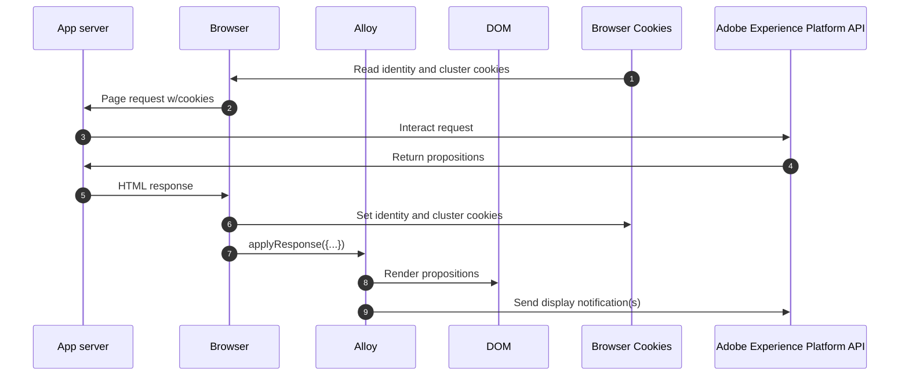

# Personalization via Hybrid implementation

## Overview

This sample demonstrates using Adobe Experience Platform to get personalization content from Adobe Target.  The web page changes based on the personalization content returned.

This sample retrieves personalization content server-side using the [Adobe Experience Platform APIs](https://developer.adobe.com/experience-platform-apis/) and renders it on the client-side using [Adobe Experience Platform Web SDK](https://experienceleague.adobe.com/docs/experience-platform/edge/home.html) using the `applyResponse` command.

Here is what the page looks like before and after personalization content is rendered.

| without personalization                                     | with personalization                                              |
|-------------------------------------------------------------|-------------------------------------------------------------------|
|  |  |

Please review the [summary of personalization content](../TargetActivities.md) for this sample.


## Running the sample

<small>Prerequisite: [install node and npm](https://docs.npmjs.com/downloading-and-installing-node-js-and-npm).</small>

To run this sample:

1. Clone the repository to your local machine.
2. Open a terminal and change directory to this sample's folder.
3. Run `npm install`
4. Run `npm start`
5. Open a web browser to [http://localhost](http://localhost)

## How it works

1. [Express](https://expressjs.com/) is used for a lean server-side implementation. To handle basic server requests and routing.
2. The web page is requested and any cookies previously stored by the browser prefixed with `kndctr_` are included.
3. When the page is requested from the app server, an event is sent to the [interactive data collection endpoint](https://experienceleague.adobe.com/docs/experience-platform/edge-network-server-api/data-collection/interactive-data-collection.html?lang=en) to fetch personalization content.  This sample app makes use of some helper methods to simplify building and sending requests to the API (see [aepEdgeClient.js](../common/aepEdgeClient.js)).  But the request is simply a `POST` with a payload that contains an event and query.  The cookies (if available) from the prior step are included with the request in the `meta>state>entries` array.
```javascript
fetch(
  "https://edge.adobedc.net/ee/v2/interact?dataStreamId=abc&requestId=123",
  {
    headers: {
      accept: "*/*",
      "accept-language": "en-US,en;q=0.9",
      "cache-control": "no-cache",
      "content-type": "text/plain; charset=UTF-8",
      pragma: "no-cache",
      "sec-fetch-dest": "empty",
      "sec-fetch-mode": "cors",
      "sec-fetch-site": "cross-site",
      "sec-gpc": "1",
      "Referrer-Policy": "strict-origin-when-cross-origin",
      Referer: "http://localhost/",
    },
    body: JSON.stringify({
      event: {
        xdm: {
          web: {
            webPageDetails: {
              URL: "http://localhost/",
            },
            webReferrer: {
              URL: "",
            },
          },
          identityMap: {
            FPID: [
              {
                id: "xyz",
                authenticatedState: "ambiguous",
                primary: true,
              },
            ],
          },
          timestamp: "2022-06-23T22:21:00.878Z",
        },
        data: {},
      },
      query: {
        identity: {
          fetch: ["ECID"],
        },
        personalization: {
          schemas: [
            "https://ns.adobe.com/personalization/default-content-item",
            "https://ns.adobe.com/personalization/html-content-item",
            "https://ns.adobe.com/personalization/json-content-item",
            "https://ns.adobe.com/personalization/redirect-item",
            "https://ns.adobe.com/personalization/dom-action",
          ],
          decisionScopes: ["__view__", "sample-json-offer"],
        },
      },
      meta: {
        state: {
          domain: "localhost",
          cookiesEnabled: true,
          entries: [
            {
              "key": "kndctr_XXX_AdobeOrg_identity",
              "value": "abc123"
            },
            {
              "key": "kndctr_XXX_AdobeOrg_cluster",
              "value": "or2"
            }
          ],
        },
      },
    }),
    method: "POST",
  }
).then((res) => res.json());
```

4. The application server returns a response with HTML and the identity and cluster cookies.
5. Within the page, the `applyResponse` command is invoked passing in the headers and body of AEP response.

```javascript
alloy("applyResponse", {
    "renderDecisions": true,
    "responseHeaders": {
      "cache-control": "no-cache, no-store, max-age=0, no-transform, private",
      "connection": "close",
      "content-encoding": "deflate",
      "content-type": "application/json;charset=utf-8",
      "date": "Mon, 11 Jul 2022 19:42:01 GMT",
      "server": "jag",
      "strict-transport-security": "max-age=31536000; includeSubDomains",
      "transfer-encoding": "chunked",
      "vary": "Origin",
      "x-adobe-edge": "OR2;9",
      "x-content-type-options": "nosniff",
      "x-konductor": "22.6.78-BLACKOUTSERVERDOMAINS:7fa23f82",
      "x-rate-limit-remaining": "599",
      "x-request-id": "5c539bd0-33bf-43b6-a054-2924ac58038b",
      "x-xss-protection": "1; mode=block"
    },
    "responseBody": {
      "requestId": "5c539bd0-33bf-43b6-a054-2924ac58038b",
      "handle": [
        {
          "payload": [
            {
              "id": "XXX",
              "namespace": {
                "code": "ECID"
              }
            }
          ],
          "type": "identity:result"
        },
        {
          "payload": [
            {...}, 
            {...}
          ],
          "type": "personalization:decisions",
          "eventIndex": 0
        }
      ]
    }
  }
).then(applyPersonalization("sample-json-offer"));

```

6. Alloy renders page load Visual Experience Composer (VEC) offers automatically because the `renderDecisions` flag is set to true.
7. Form-based JSON offers are manually applied by the sample implementation code (in the [`applyPersonalization`](./public/script.js) method) to update the DOM based on the offer.
8. For form-based activities, display events must manually be sent to indicate when the offer has been displayed. This is done via the `sendEvent` command.


```javascript
function sendDisplayEvent(decision) {
  const { id, scope, scopeDetails = {} } = decision;

  alloy("sendEvent", {
    xdm: {
      eventType: "decisioning.propositionDisplay",
      _experience: {
        decisioning: {
          propositions: [
            {
              id: id,
              scope: scope,
              scopeDetails: scopeDetails,
            },
          ],
        },
      },
    },
  });
}
```

## Key Observations

### Cookies
Cookies are used to persist user identity and cluster information.  When using a hybrid implementation, the application server must handle the storing and sending of these cookies during the request lifecycle.

| Cookie                   | Purpose                                                                    | Stored by          | Sent by            |
|--------------------------|----------------------------------------------------------------------------|--------------------|--------------------|
| kndctr_AdobeOrg_identity | Contains user identity details                                             | application server | application server |
| kndctr_AdobeOrg_cluster  | Indicates which experience edge cluster should be used to fulfill requests | application server | application server |


### Request placement

Requests to Adobe Experience Platform API are required to get propositions and send a display notification.  When using a client-side implementation, the Web SDK makes these requests when the `sendEvent` command is used.

| Request                                        | Made by                                                      |
|------------------------------------------------|--------------------------------------------------------------|
| interact request to get propositions           | application server calling the Adobe Experience Platform API |
| interact request to send display notifications | Web SDK                                                      |

### Flow Diagram



## Beyond the sample

This sample app can serve as a starting point for you to experiment and learn more about Adobe Experience Platform. For example, you can change a few environment variables so the sample app pulls in offers from your own AEP configuration.  To do so, just open the `.env` file at the root of this repository and modify the variables.  Restart the sample app, and you're ready to experiment using your own personalization content.
