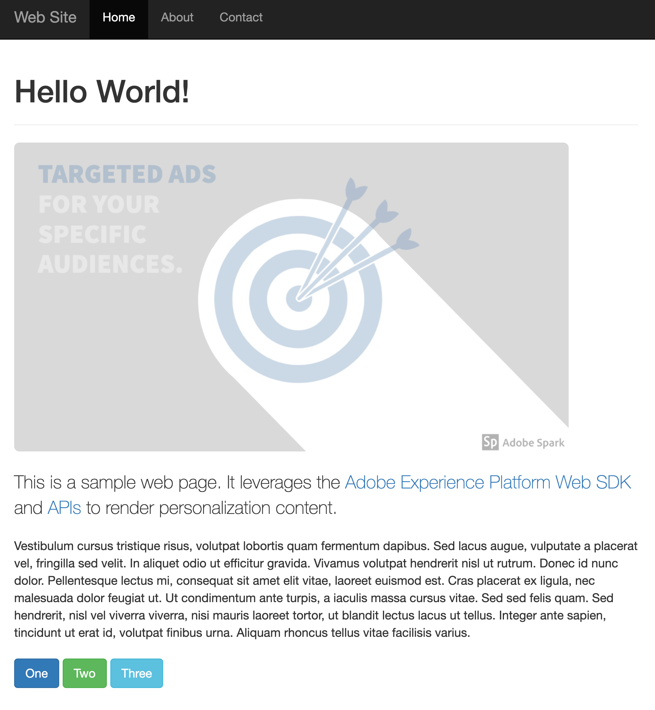
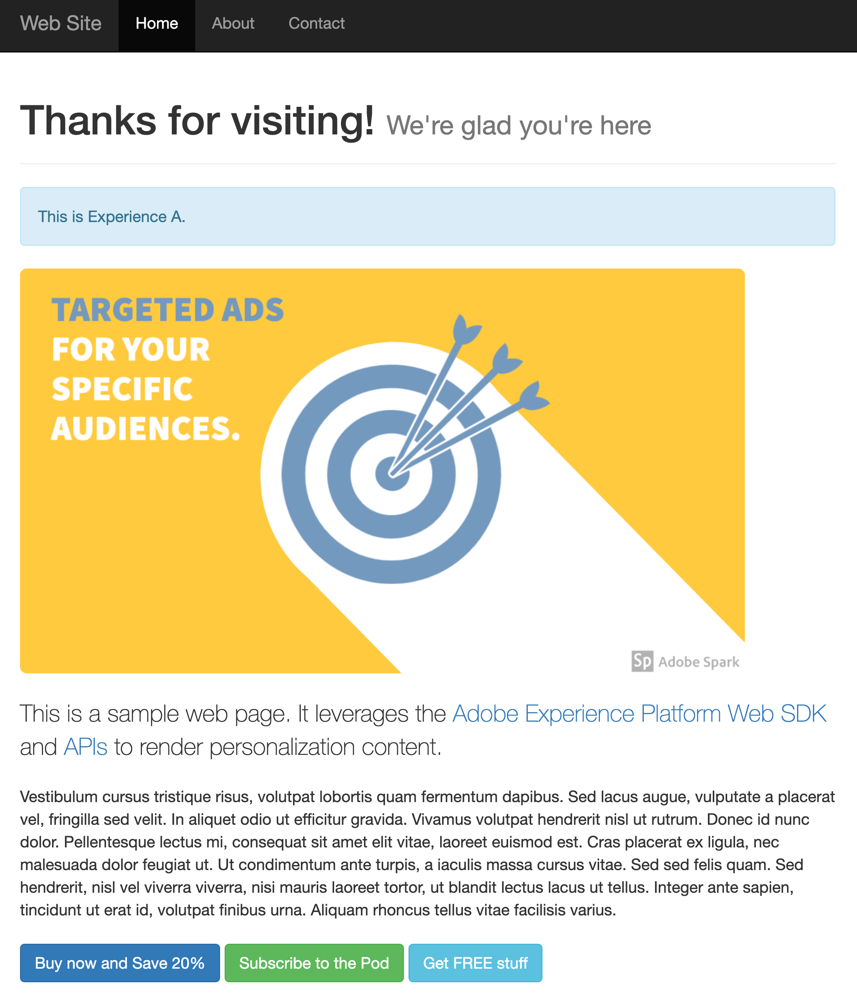
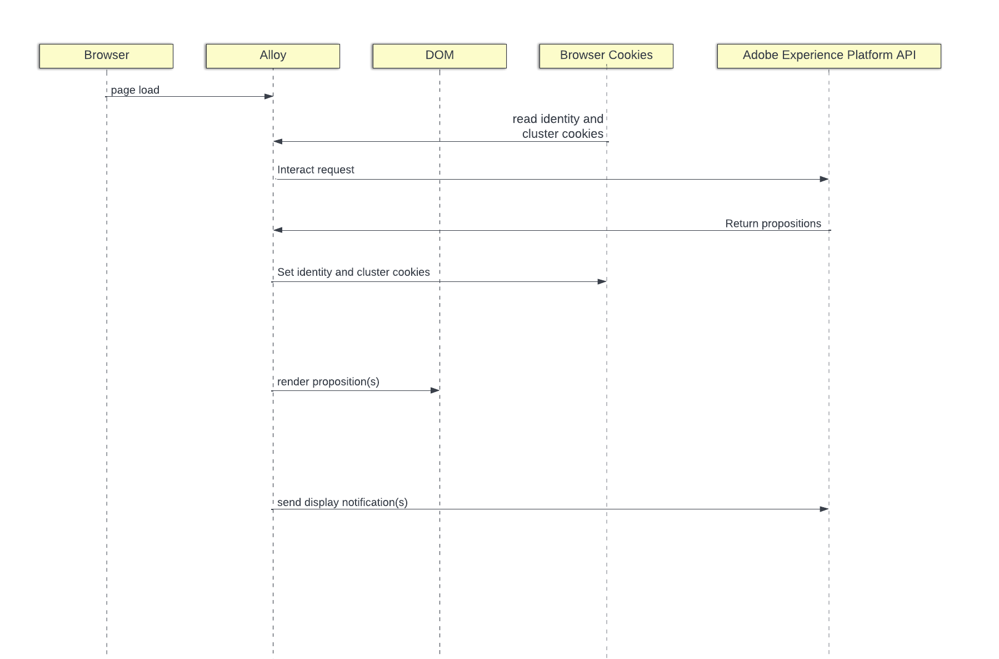

# Target Offers Client-side

## Overview

This sample demonstrates using Adobe Experience Platform to get personalization content from Adobe Target.  The web page changes based on the personalization content returned.  

This sample uses the [Adobe Experience Platform Web SDK](https://experienceleague.adobe.com/docs/experience-platform/edge/home.html) to get personalization content and to render it entirely client-side. 

Here is what the page looks like before and after personalization content is rendered. 

| without target personalization                              | with target personalization                                       |
|-------------------------------------------------------------|-------------------------------------------------------------------|
|  |  |

Please review the [summary of target activities used](../TargetActivities.md) for this sample. 


## Running the sample

<small>Prerequisite: [install node and npm](https://docs.npmjs.com/downloading-and-installing-node-js-and-npm).</small>

To run this sample:

1. Clone the repository to your local machine.
2. Open a terminal and change directory to this sample's folder.
3. Run `npm install`
4. Run `npm start`
5. Open a web browser to [http://localhost](http://localhost)

## How it works

1. [Alloy](https://experienceleague.adobe.com/docs/experience-platform/edge/home.html) is included on the page.
2. The `sendEvent` command is used to fetch personalization content.

```javascript
alloy("sendEvent", {
    "renderDecisions": true,
    decisionScopes: ["sample-json-offer"]
  }
).then(applyPersonalization("sample-json-offer"));
```

3. Alloy renders page load Visual Experience Composer (VEC) offers automatically because the `renderDecisions` flag is set to true.
4. Form-based JSON offers are manually applied by the sample implementation code (in the [`applyPersonalization`](./public/script.js) method) to update the DOM based on the offer.
5. For form-based activities, display events must manually be sent to indicate when the offer has been displayed. This is done via the `sendEvent` command.

```javascript
function sendDisplayEvent(decision) {
  const { id, scope, scopeDetails = {} } = decision;

  alloy("sendEvent", {
    xdm: {
      eventType: "decisioning.propositionDisplay",
      _experience: {
        decisioning: {
          propositions: [
            {
              id: id,
              scope: scope,
              scopeDetails: scopeDetails,
            },
          ],
        },
      },
    },
  });
}
```

## Key Observations

### Cookies
Cookies are used to persist user identity and cluster information.  When using a client-side implementation, the Web SDK handles the storing and sending of these cookies automatically during the request lifecycle.

| Cookie                   | Purpose                                                                   | Stored by | Sent by |
|--------------------------|---------------------------------------------------------------------------|-----------|---------|
| kndctr_AdobeOrg_identity | Contains user idenity details                                             | Web SDK   | Web SDK |
| kndctr_AdobeOrg_cluster  | Indicates which experience edge cluser should be used to fulfill requests | Web SDK   | Web SDK |


### Request placement

Requests to Adobe Experience Platform API are required to get propositions and send a display notification.  When using a client-side implementation, the Web SDK makes these reqeusts when the `sendEvent` command is used.

| Request                                        | Made by                             |
|------------------------------------------------|-------------------------------------|
| interact request to get propositions           | Web SDK using the sendEvent command |
| interact request to send display notifications | Web SDK using the sendEvent command |

### Flow Diagram



## Beyond the sample

This sample app can serve as a starting point for you to experiment and learn more about Adobe Experience Platform. For example, you can change a few environment variables so the sample app pulls in offers from your own AEP configuration.  To do so, just open the `.env` file at the root of this repository and modify the variables.  Restart the sample app, and you're ready to experiemnt using your own personalization content.
